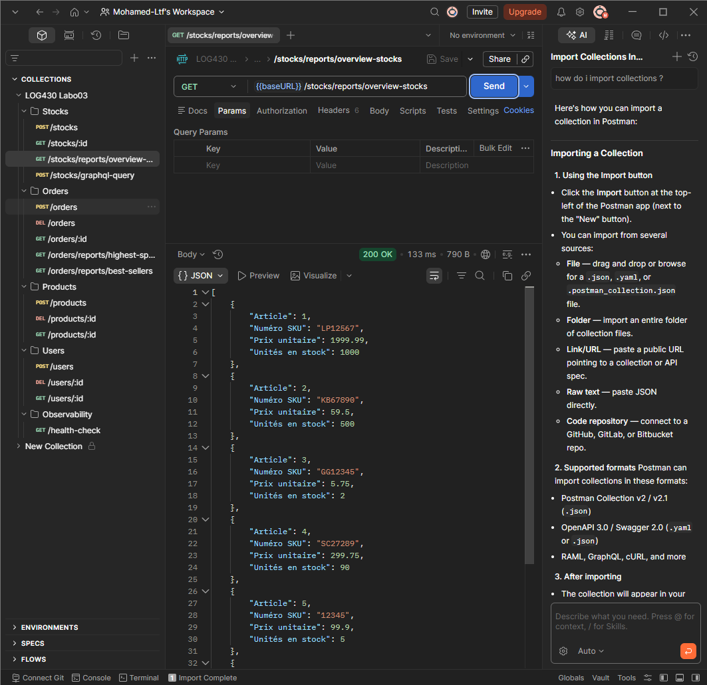
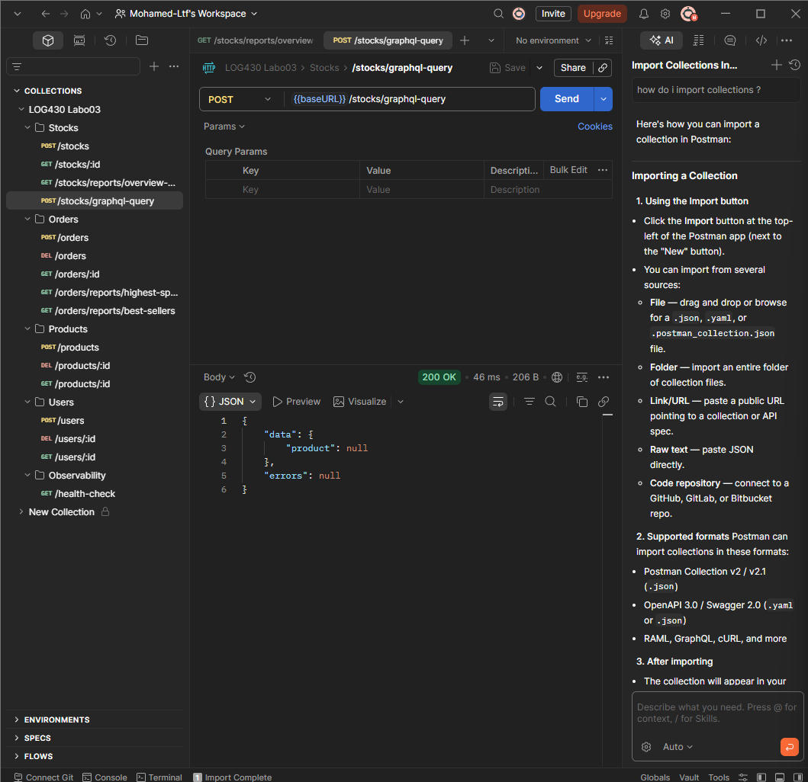
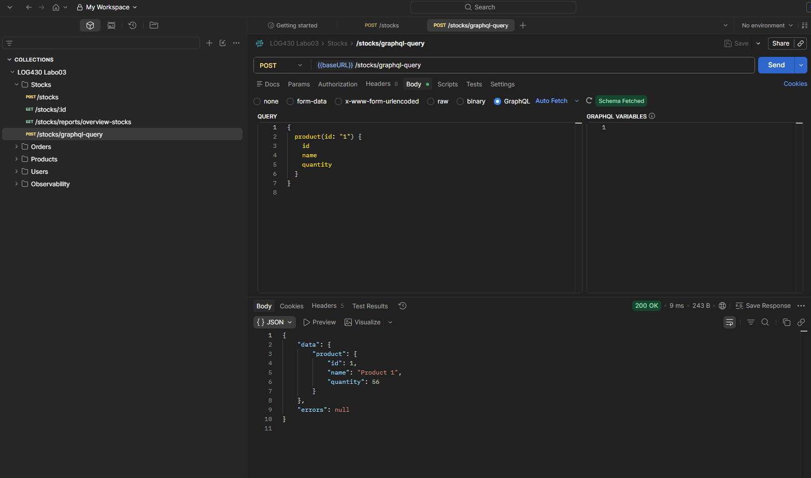
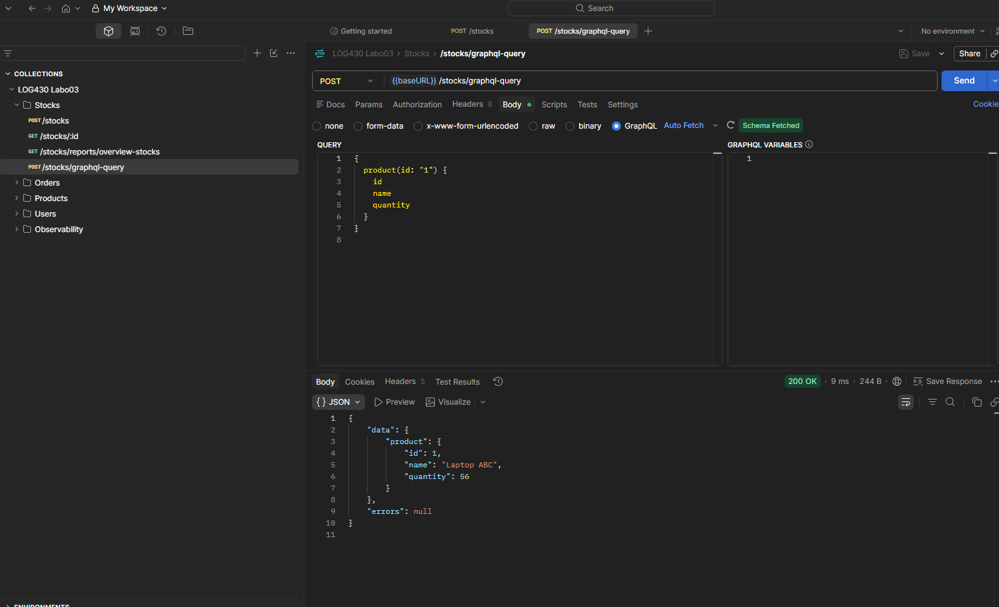
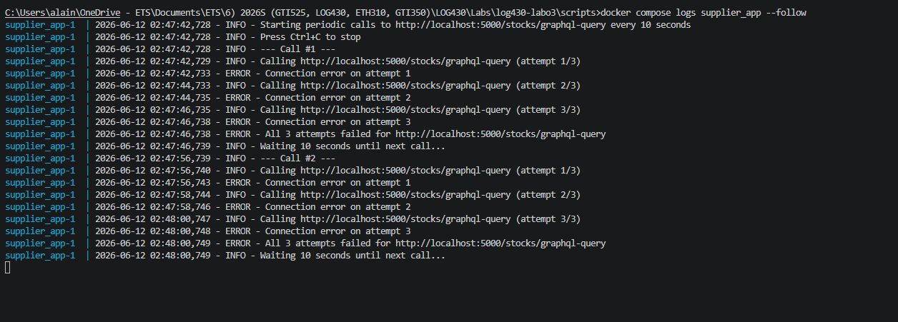
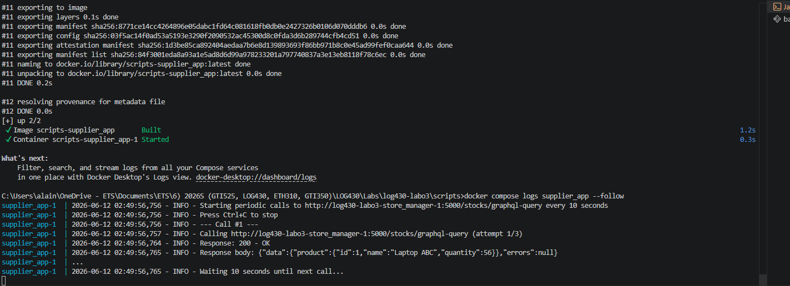
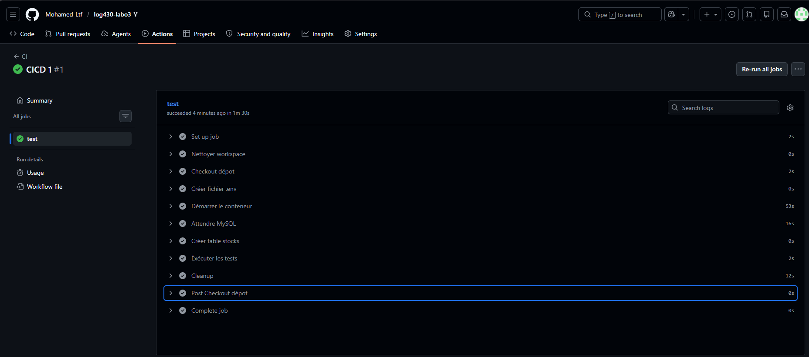

# Labo 03 – REST APIs, GraphQL
ÉTS - LOG430 - Architecture logicielle - Été 2026

Étudiant : Mohamed Loutfi

# Questions

## Question 1 : Dans la [RFC 7231](https://www.rfc-editor.org/rfc/rfc7231#section-4.2.1), nous trouvons que certaines méthodes HTTP sont considérées comme sûres (__safe__) ou idempotentes, en fonction de leur capacité à modifier (ou non) l'état de l'application. Lisez les sections **4.2.1** et **4.2.2** de la RFC 7231 et répondez : parmi les méthodes mentionnées dans l'activité 2, lesquelles sont sûres, non sûres, idempotentes et/ou non idempotentes?


- **GET** (pour vérifier le stock) : sûre et idempotente et elle modifie pas l'état de l'application et retourne toujours le même résultat.
- **POST** (pour créer un produit, ajouter un stock, créer une commande) : non sûre et non idempotente et elle modifie l'état et chaque appel va créer une nouvelle ressource.
- **DELETE** (supprimer une commande) : non sûre mais idempotente et elle modifie l'état. Aussi supprimer la même ressource plusieurs fois donne le même résultat final.

## Question 2 : Décrivez l'utilisation de la méthode join dans ce cas. Utilisez les méthodes telles que décrites à `Simple Relationship Joins` et `Joins to a Target with an ON Clause` dans la documentation SQLAlchemy pour ajouter les colonnes demandées dans cette activité. Veuillez inclure le code pour illustrer votre réponse.

La méthode `join` de SQLAlchemy permet de combiner les données de deux tables en une seule requête en joinant `Stock` avec `Product` via `product_id` pour récupérer `name`, `sku` et `price` sans faire deux requêtes séparées.

```
results = session.query(
        Stock.product_id,
        Stock.quantity,
        Product.name,
        Product.sku,
        Product.price
    ).join(Product, Stock.product_id == Product.id).all()
```

C'est le pattern "Join to a Target with an ON Clause" de SQLAlchemy. Ça spécifie explicitement la condition de jointure avec `Stock.product_id == Product.id`.



## Question 3 : Quels résultats avez-vous obtenus en utilisant l’endpoint `POST /stocks/graphql-query` avec la requête suggérée ? Veuillez joindre la sortie de votre requête dans Postman afin d’illustrer votre réponse.

Avant les améliorations, l'endpoint retournait `"product": null` car Redis ne contenait pas encore de données de stock. Une fois le stock ajouté via `POST /stocks`, l'endpoint retournait `id` et `quantity`, mais sans `name`, `sku` ni `price`.





## Question 4 : Quelles lignes avez-vous changé dans `update_stock_redis`? Veuillez joindre du code afin d’illustrer votre réponse.

J'ai remplacé la ligne qui stockait seulement `quantity` dans Redis par un `hset` avec `mapping` qui stocke aussi `name`, `sku` et `price`. Pour obtenir ces informations, j'ai ajouté une session SQLAlchemy pour aller chercher le produit dans MySQL :

```
product = session.query(Product).filter_by(id=product_id).first()
            pipeline.hset(f"stock:{product_id}", mapping={
                "quantity": new_quantity,
                "name": product.name if product else '',
                "sku": product.sku if product else '',
                "price": float(product.price) if product else 0
            })
```

J'ai aussi fait le même changement dans `set_stock_for_product` pour que Redis soit peuplé correctement dès le premier `POST /stocks`.

## Question 5 : Quels résultats avez-vous obtenus en utilisant l’endpoint `POST /stocks/graphql-query` avec les améliorations ? Veuillez joindre la sortie de votre requête dans Postman afin d’illustrer votre réponse.

Après les améliorations, l'endpoint retourne le vrai `name`, `sku` et `price` du produit en plus de `id` et `quantity`.



## Question 6 : Examinez attentivement le fichier `docker-compose.yml` du répertoire `scripts`, ainsi que celui situé à la racine du projet. Qu’ont-ils en commun ? Par quel mécanisme ces conteneurs peuvent-ils communiquer entre eux ? Veuillez joindre du code YML afin d’illustrer votre réponse.

Les deux fichiers `docker-compose.yml` partagent le réseau `labo03-network` déclaré comme `external: true`. Ce réseau commun permet aux deux conteneurs de communiquer directement.

`docker-compose.yml` (racine) :
```
networks:
  labo03-network:
    driver: bridge
    external: true
```

`scripts/docker-compose.yml` :
```
networks:
  labo03-network:
    driver: bridge
    external: true
```

Le conteneur `supplier_app` va contacter `store_manager` via son nom de conteneur comme hostname. Avant la correction, l'URL `localhost:5000` ne fonctionnait pas depuis l'intérieur d'un conteneur :



Après correction avec le nom du conteneur `log430-labo3-store_manager-1:5000`, la communication fonctionne avec `200 OK` :



# Déploiement

1. Le pipeline se déclenche à chaque `git push`.
2. Le runner auto-hébergé sur la VM `LOG430-Lab00-vm` reçoit le job.
3. Le workspace est nettoyé pour éviter les conflits.
4. Le fichier `.env` est recréé à partir des secrets GitHub.
5. Les conteneurs sont démarrés avec `docker compose up -d --build`.
6. Le pipeline attend que MySQL soit prêt.
7. La table `stocks` est créée si elle n'existe pas.
8. Les tests sont exécutés via pytest dans le conteneur.

